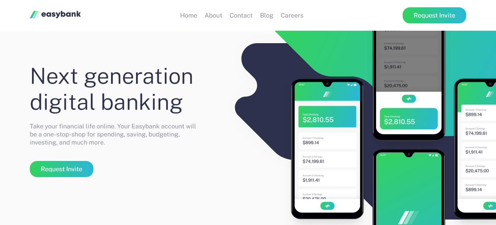

# Easybank landing page solution

EasyBank is an imaginary FinTech landing page. it is a solution to the [Easybank landing page challenge on Frontend Mentor](https://www.frontendmentor.io/challenges/easybank-landing-page-WaUhkoDN).

## Table of contents

- [Overview](#overview)
  - [The challenge](#the-challenge)
  - [Screenshot](#screenshot)
  - [Links](#links)
- [My process](#my-process)
  - [Built with](#built-with)
- [Author](#author)
- [Acknowledgments](#acknowledgments)

**Note: Delete this note and update the table of contents based on what sections you keep.**

## Overview

### The challenge

Users should be able to:

- View the optimal layout for the site depending on their device's screen size
- See hover states for all interactive elements on the page

### Screenshot

### Links

- Solution URL: [solution](https://www.frontendmentor.io/solutions/easybank-landing-page-96pVcBHh_)
- Live Site URL: [eazzybank](https://eazzybank.netlify.app/)

## My process

### Built with

- Semantic HTML5 markup
- CSS custom properties
- Flexbox
- CSS Grid
- Mobile-first workflow
- Sass

## Author

- Website - [Ohien Stephen](https://https://ohienstephen.github.io)
- Frontend Mentor - [@Stephen0009](https://www.frontendmentor.io/profile/Stephen0009)
- Twitter - [@ohienstephen](https://www.twitter.com/ohienstephen)

## Acknowledgments

Ohien Stephen

**it was fun building!** 🚀
